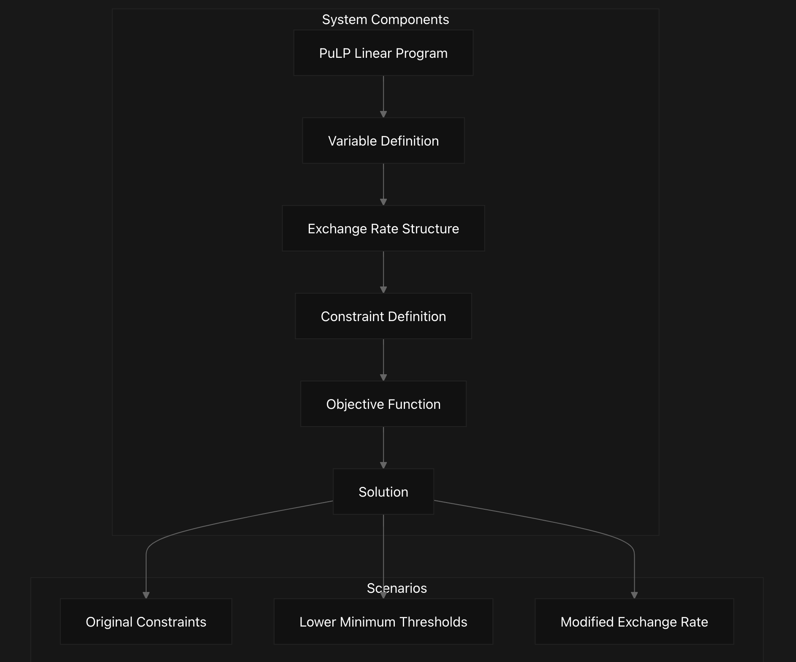
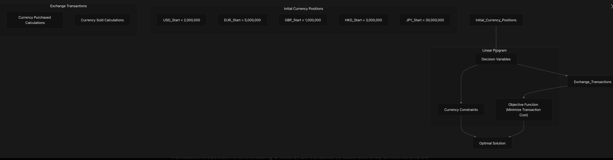
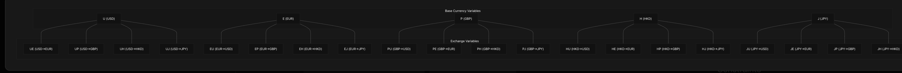
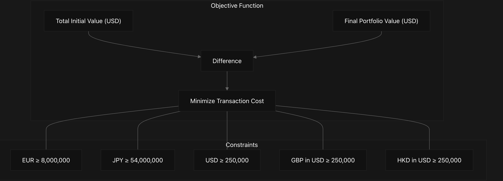

# NU_MSDS_460_Assignment1 Overview
Currency optimization using linear programming and Python packages.

This document describes a Currency Exchange Optimization System that uses linear programming to minimize transaction costs while maintaining required currency holdings across multiple currencies. The system is implemented in Python using the PuLP library, providing a mathematical model to determine optimal currency exchange strategies.

## Purpose and Scope
The Currency Exchange Optimization System addresses the problem of optimizing currency holdings across USD, EUR, GBP, HKD, and JPY while minimizing costs associated with currency exchange. The optimization model:
- Determines how much of each currency to hold and exchange
- Minimizes transaction costs due to exchange rate spreads
- Ensures minimum required amounts are maintained in each currency
- Evaluates different scenarios by modifying constraints and exchange rates


## System Architecture
The system is structured as a linear optimization problem that tracks both initial currency amounts and exchanges between currencies. The optimization determines which exchanges to make to achieve the minimum cost while satisfying all constraints.


## Currency Variables and Exchange Structure
The system models five base currencies (USD, EUR, GBP, HKD, JPY) and all possible exchange transactions between them, creating a total of 25 variables (5 base currency amounts and 20 exchange transactions).


## Exchange Rate Structure
The exchange rates are defined as conversion factors between currencies. Each pair of currencies has a specific exchange rate, and the rates account for transaction costs by having slightly different values for buying versus selling.

From Currency	To USD	To EUR	To GBP	To HKD	To JPY
USD	          1.0	    1.01864	0.6409	7.7985	118.55
EUR	          0.9724	1.0	0.6295	    7.6552	116.41
GBP	          1.5593	1.5881	1.0	    12.154	184.97
HKD	          0.12812	0.1304	0.0821	1.0	    15.1005
JPY	          0.00843	0.00856	0.0054	0.0658	1.0

## Objective Function and Constraints
The objective function minimizes the transaction cost, calculated as the difference between the initial portfolio value and the final portfolio value (both in USD). The constraints ensure that minimum currency holdings are maintained.

### Objective Function
```
Minimize: Total_Start_inUSD - Final_Portfolio_Value_in_USD
```
Where:

Total_Start_inUSD = initial portfolio value in USD
Final_Portfolio_Value_in_USD = value after all exchanges

### Constraints
The system applies two types of constraints:
1. Direct currency amounts (EUR, JPY)
2. USD-equivalent values (USD, GBP, HKD)


## Scenario Analysis
The system explores three different optimization scenarios:

1. Original Constraints (Question 1): Base scenario with minimum holdings of 250,000 USD for USD, GBP, and HKD, 8,000,000 EUR, and 54,000,000 JPY
- Result: Optimal solution with transaction cost of $27,866.84
2. Lower Threshold (Question 4): Reduced minimum holdings to 50,000 USD for USD, GBP, and HKD
- Result: Optimal solution with transaction cost of $27,860.19 (slight improvement)
3. Modified Exchange Rate (Question 5): Changed GBP to USD exchange rate from 0.6409 to 0.6414
- Result: Unbounded solution, indicating a potential arbitrage opportunity

This overview provides a high-level understanding of the Currency Exchange Optimization System. For more detailed explanations of specific components, please refer to the linked wiki pages.

**Code Notebook**
*Run this code:*

```
#setup model
from pulp import LpVariable, LpProblem, LpMaximize, LpMinimize, LpStatus, value
prob = LpProblem("problem", LpMinimize)
#define variables
U = LpVariable("U", 250000, None)
E = LpVariable("E", 257096, None)
P = LpVariable("P", 160328, None)
H = LpVariable("H", 1951296, None)
J = LpVariable("J", 29655991, None)
UE = LpVariable("UE", 0, None)
UP = LpVariable("UP", 0, None)
UH = LpVariable("UH", 0, None)
UJ = LpVariable("UJ", 0, None)
EU = LpVariable("EU", 0, None)
EP = LpVariable("EP", 0, None)
EH = LpVariable("EH", 0, None)
EJ = LpVariable("EJ", 0, None)
PU = LpVariable("PU", 0, None)
PE = LpVariable("PE", 0, None)
PH = LpVariable("PH", 0, None)
PJ = LpVariable("PJ", 0, None)
HU = LpVariable("HU", 0, None)
HE = LpVariable("HE", 0, None)
HP = LpVariable("HP", 0, None)
HJ = LpVariable("HJ", 0, None)
JU = LpVariable("JU", 0, None)
JE = LpVariable("JE", 0, None)
JP = LpVariable("JP", 0, None)
JH = LpVariable("JH", 0, None)
#setup objective function
USD_Start = 2000000
EUR_Start = 5000000
GBP_Start = 1000000
HKD_Start = 3000000
JPY_Start = 30000000
Total_Start_inUSD = 1*USD_Start + 0.9724*EUR_Start + 1.5593*GBP_Start + 0.12812*HKD_Start + 0.00843*JPY_Start
#create variables
USD_Purchased = 1*U + 0.9724*EU + 1.5593*PU + 0.12812*HU + 0.00843*JU
EUR_Purchased = 1.01864*UE + 1*E + 1.5881*PE + 0.1304*HE + 0.00856*JE
GBP_Purchased = 0.6409*UP + 0.6295*EP + 1*P + 0.0821*HP + 0.0054*JP
HKD_Purchased = 7.7985*UH + 7.6552*EH + 12.154*PH + 1*H + 0.0658*JH
JPY_Purchased = 118.55*UJ + 116.41*EJ + 184.97*PJ + 15.1005*HJ + 1*J
USD_Sold = U + UE + UP + UH + UJ
EUR_Sold = EU + E + EP + EH + EJ
GBP_Sold = PU + PE + P + PH + PJ
HKD_Sold = HU + HE + HP + H + HJ
JPY_Sold = JU + JE + JP + JH + J
prob += Total_Start_inUSD - ((USD_Start + USD_Purchased - USD_Sold)*1 + \
                             (EUR_Start + EUR_Purchased - EUR_Sold)*0.9724 + \
                             (GBP_Start + GBP_Purchased - GBP_Sold)*1.5593 + \
                             (HKD_Start + HKD_Purchased - HKD_Sold)*0.12812 + \
                             (JPY_Start + JPY_Purchased - JPY_Sold)*0.00843)
#Constraints for EUR and JPY currencies:
prob += EUR_Start + EUR_Purchased - EUR_Sold >= 8000000
prob += JPY_Start + JPY_Purchased - JPY_Sold >= 54000000

#Constraints for USD, GDP, and HKD currencies (all represented in USD):
prob += USD_Start + USD_Purchased - USD_Sold >= 250000
prob += (GBP_Start + GBP_Purchased - GBP_Sold)*1.5593 >= 250000
prob += (HKD_Start + HKD_Purchased - HKD_Sold)*0.12812 >= 250000
status = prob.solve()

print(f"Question 1")
print(f"status={LpStatus[status]}")

for variable in prob.variables():
  print(f"{variable.name}={variable.varValue}")

print(f"Minimal transaction cost in USD = {round(value(prob.objective), 2)}")
print(f"")
Question 1
status=Optimal
E=257096.0
EH=0.0
EJ=0.0
EP=0.0
EU=0.0
H=1951296.0
HE=0.0
HJ=0.0
HP=0.0
HU=9689169.8
J=29655991.0
JE=0.0
JH=131314060.0
JP=0.0
JU=0.0
P=160328.0
PE=0.0
PH=0.0
PJ=839671.65
PU=0.0
U=250000.0
UE=2945103.3
UH=0.0
UJ=0.0
UP=0.0
Minimal transaction cost in USD = 27866.84

# Q 3
print(f"Minimal transaction cost in USD = {round(value(prob.objective), 2)}")
Minimal transaction cost in USD = 27866.84
#Q 4 lower threshold
prob2 = LpProblem("problem2", LpMinimize)
# Change lower threshold value of each currency to 50K USD:
U = LpVariable("U", 50000, None)
E = LpVariable("E", 51419, None)
P = LpVariable("P", 32066, None)
H = LpVariable("H", 390259, None)
J = LpVariable("J", 5931198, None)
UE = LpVariable("UE", 0, None)
UP = LpVariable("UP", 0, None)
UH = LpVariable("UH", 0, None)
UJ = LpVariable("UJ", 0, None)
EU = LpVariable("EU", 0, None)
EP = LpVariable("EP", 0, None)
EH = LpVariable("EH", 0, None)
EJ = LpVariable("EJ", 0, None)
PU = LpVariable("PU", 0, None)
PE = LpVariable("PE", 0, None)
PH = LpVariable("PH", 0, None)
PJ = LpVariable("PJ", 0, None)
HU = LpVariable("HU", 0, None)
HE = LpVariable("HE", 0, None)
HP = LpVariable("HP", 0, None)
HJ = LpVariable("HJ", 0, None)
JU = LpVariable("JU", 0, None)
JE = LpVariable("JE", 0, None)
JP = LpVariable("JP", 0, None)
JH = LpVariable("JH", 0, None)
#USD_Start = 2000000
EUR_Start = 5000000
GBP_Start = 1000000
HKD_Start = 3000000
JPY_Start = 30000000
Total_Start_inUSD = 1*USD_Start + 0.9724*EUR_Start + 1.5593*GBP_Start + 0.12812*HKD_Start + 0.00843*JPY_Start

USD_Purchased = 1*U + 0.9724*EU + 1.5593*PU + 0.12812*HU + 0.00843*JU
EUR_Purchased = 1.01864*UE + 1*E + 1.5881*PE + 0.1304*HE + 0.00856*JE
GBP_Purchased = 0.6409*UP + 0.6295*EP + 1*P + 0.0821*HP + 0.0054*JP
HKD_Purchased = 7.7985*UH + 7.6552*EH + 12.154*PH + 1*H + 0.0658*JH
JPY_Purchased = 118.55*UJ + 116.41*EJ + 184.97*PJ + 15.1005*HJ + 1*J

USD_Sold = U + UE + UP + UH + UJ
EUR_Sold = EU + E + EP + EH + EJ
GBP_Sold = PU + PE + P + PH + PJ
HKD_Sold = HU + HE + HP + H + HJ
JPY_Sold = JU + JE + JP + JH + J

prob2 += Total_Start_inUSD - ((USD_Start + USD_Purchased - USD_Sold)*1 + \
                             (EUR_Start + EUR_Purchased - EUR_Sold)*0.9724 + \
                             (GBP_Start + GBP_Purchased - GBP_Sold)*1.5593 + \
                             (HKD_Start + HKD_Purchased - HKD_Sold)*0.12812 + \
                             (JPY_Start + JPY_Purchased - JPY_Sold)*0.00843)
#Constraints for EUR and JPY currencies remain the same
prob2 += EUR_Start + EUR_Purchased - EUR_Sold >= 8000000
prob2 += JPY_Start + JPY_Purchased - JPY_Sold >= 54000000

#Constraints for USD, GDP, and HKD currencies (all represented in USD) change to become >= 50K:
prob2 += USD_Start + USD_Purchased - USD_Sold >= 50000
prob2 += (GBP_Start + GBP_Purchased - GBP_Sold)*1.5593 >= 50000
prob2 += (HKD_Start + HKD_Purchased - HKD_Sold)*0.12812 >= 50000
status = prob2.solve()

print(f"Question 4")
print(f"status={LpStatus[status]}")

for variable in prob2.variables():
  print(f"{variable.name}={variable.varValue}")

print(f"Minimal transaction cost in USD = {round(value(prob2.objective), 2)}")
print(f"")
Question 4
status=Optimal
E=51419.0
EH=0.0
EJ=0.0
EP=0.0
EU=0.0
H=390259.0
HE=0.0
HJ=0.0
HP=0.0
HU=12811295.0
J=5931198.0
JE=0.0
JH=155038810.0
JP=0.0
JU=0.0
P=32066.0
PE=0.0
PH=0.0
PJ=967934.33
PU=0.0
U=50000.0
UE=2945103.3
UH=0.0
UJ=0.0
UP=0.0
Minimal transaction cost in USD = 27860.19

#q5
prob3 = LpProblem("problem3", LpMinimize)
U = LpVariable("U", 250000, None)
E = LpVariable("E", 257096, None)
P = LpVariable("P", 160328, None)
H = LpVariable("H", 1951296, None)
J = LpVariable("J", 29655991, None)
UE = LpVariable("UE", 0, None)
UP = LpVariable("UP", 0, None)
UH = LpVariable("UH", 0, None)
UJ = LpVariable("UJ", 0, None)
EU = LpVariable("EU", 0, None)
EP = LpVariable("EP", 0, None)
EH = LpVariable("EH", 0, None)
EJ = LpVariable("EJ", 0, None)
PU = LpVariable("PU", 0, None)
PE = LpVariable("PE", 0, None)
PH = LpVariable("PH", 0, None)
PJ = LpVariable("PJ", 0, None)
HU = LpVariable("HU", 0, None)
HE = LpVariable("HE", 0, None)
HP = LpVariable("HP", 0, None)
HJ = LpVariable("HJ", 0, None)
JU = LpVariable("JU", 0, None)
JE = LpVariable("JE", 0, None)
JP = LpVariable("JP", 0, None)
JH = LpVariable("JH", 0, None)
USD_Start = 2000000
EUR_Start = 5000000
GBP_Start = 1000000
HKD_Start = 3000000
JPY_Start = 30000000
Total_Start_inUSD = 1*USD_Start + 0.9724*EUR_Start + 1.5593*GBP_Start + 0.12812*HKD_Start + 0.00843*JPY_Start

USD_Purchased = 1*U + 0.9724*EU + 1.5593*PU + 0.12812*HU + 0.00843*JU
EUR_Purchased = 1.01864*UE + 1*E + 1.5881*PE + 0.1304*HE + 0.00856*JE
GBP_Purchased = 0.6414*UP + 0.6295*EP + 1*P + 0.0821*HP + 0.0054*JP # here is where we change the GBP -> USD exchange rate
HKD_Purchased = 7.7985*UH + 7.6552*EH + 12.154*PH + 1*H + 0.0658*JH
JPY_Purchased = 118.55*UJ + 116.41*EJ + 184.97*PJ + 15.1005*HJ + 1*J

USD_Sold = U + UE + UP + UH + UJ
EUR_Sold = EU + E + EP + EH + EJ
GBP_Sold = PU + PE + P + PH + PJ
HKD_Sold = HU + HE + HP + H + HJ
JPY_Sold = JU + JE + JP + JH + J

prob3 += Total_Start_inUSD - ((USD_Start + USD_Purchased - USD_Sold)*1 + \
                             (EUR_Start + EUR_Purchased - EUR_Sold)*0.9724 + \
                             (GBP_Start + GBP_Purchased - GBP_Sold)*1.5593 + \
                             (HKD_Start + HKD_Purchased - HKD_Sold)*0.12812 + \
                             (JPY_Start + JPY_Purchased - JPY_Sold)*0.00843)
#Constraints for EUR and JPY currencies:
prob3 += EUR_Start + EUR_Purchased - EUR_Sold >= 8000000
prob3 += JPY_Start + JPY_Purchased - JPY_Sold >= 54000000

#Constraints for USD, GDP, and HKD currencies (all represented in USD):
prob3 += USD_Start + USD_Purchased - USD_Sold >= 250000
prob3 += (GBP_Start + GBP_Purchased - GBP_Sold)*1.5593 >= 250000
prob3 += (HKD_Start + HKD_Purchased - HKD_Sold)*0.12812 >= 250000
status = prob3.solve()

print(f"Question 5")
print(f"status={LpStatus[status]}")

for variable in prob3.variables():
  print(f"{variable.name}={variable.varValue}")

print(f"Minimal transaction cost in USD = {round(value(prob3.objective), 2)}")
print(f"")
Question 5
status=Unbounded
E=257096.0
EH=0.0
EJ=0.0
EP=0.0
EU=0.0
H=1951296.0
HE=0.0
HJ=0.0
HP=0.0
HU=1048704.3
J=29655991.0
JE=0.0
JH=0.0
JP=0.0
JU=0.0
P=160328.0
PE=0.0
PH=0.0
PJ=129750.77
PU=680268.89
U=250000.0
UE=2945103.3
UH=0.0
UJ=0.0
UP=0.0
Minimal transaction cost in USD = 27903.65
```
